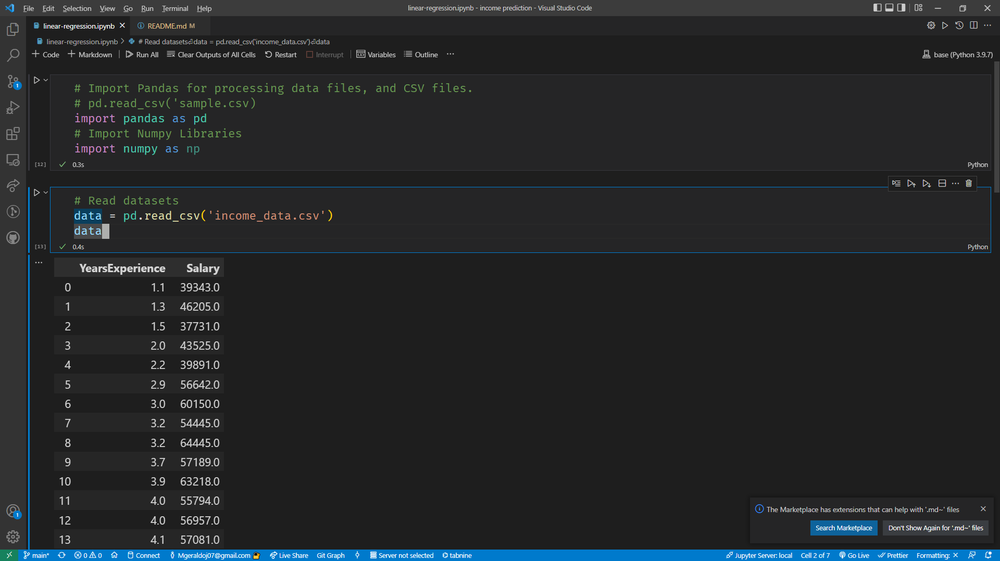

# Linear Regression Model
***

In this project (jupyter notebook) we are using <a href="https://scikit-learn.org/">SickitLearn</a> models, to perform linear regression to make income predictions with the dataset made available in the repository.

Linear regression, is a supervised machine learning model which implements a linear relationship between an independent and 
dependent variable. It is a statistical method of making predictive analysis.  We can illustrate linear regression by the below formula:

<i>y= a0+a1x+ ε</i>

Where
<i>Y</i> represents  = The Dependent Variable (Target Variable)
X represents = The Independent Variable (Predictor Variable)
a0 represents = The intercept of the line (Gives an additional degree of freedom)
a1 represents = The Linear regression coefficient (Scale factor for each input value)
ε represents = The Random error

## Preparing Data For Linear Regression
***

1. Linear Assumption. 
2. Eliminate Noise (Carry out data cleaning)
3. Eliminate Collinearity.
4. Rescale the provided inputs.

## Requirements

These are the tools, environment variables and libraries used in the project.

1. Jupyter Notebook.
2. Python 3+
3. SickitLearn
4. Pandas
5. Numpy Libraries
6. Data Set (Already Provided)

## Installation

To use this project, you need to clone the repository.

``> git clone https://github.com/grayoj/income-prediction.git``

After you finish cloning, install these modules using Pip

Install Sklearn

``> pip install sklearn``

Install Pandas to read datasets (CSV)

``> pip install pandas``

Install NumPy

``> pip install numpy``

Ensure you have Jupyter Notebook installed, which you could easily set up if you use VsCode

### Try out the notebook!

Any suggestions, feedback and help, as well as improvements are all welcome and will be appreciated.
Contact!
<a href="mailto:mgeraldoj07@gmail.com">Mail me, here.</a>
